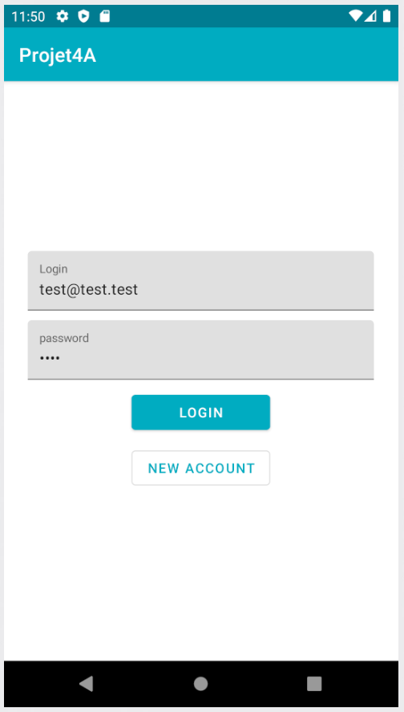
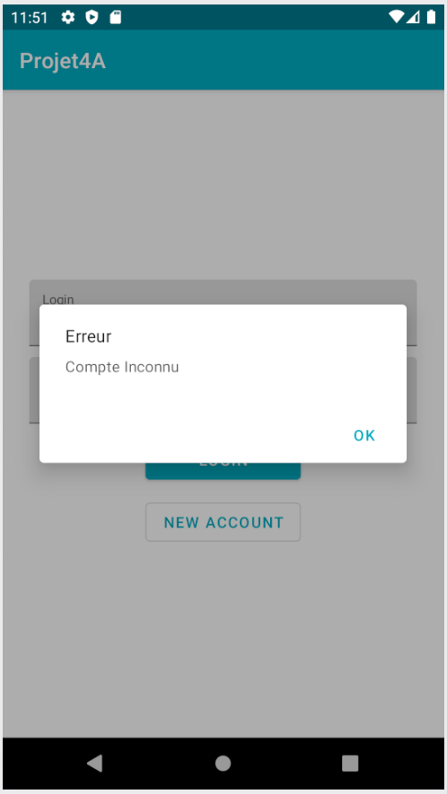
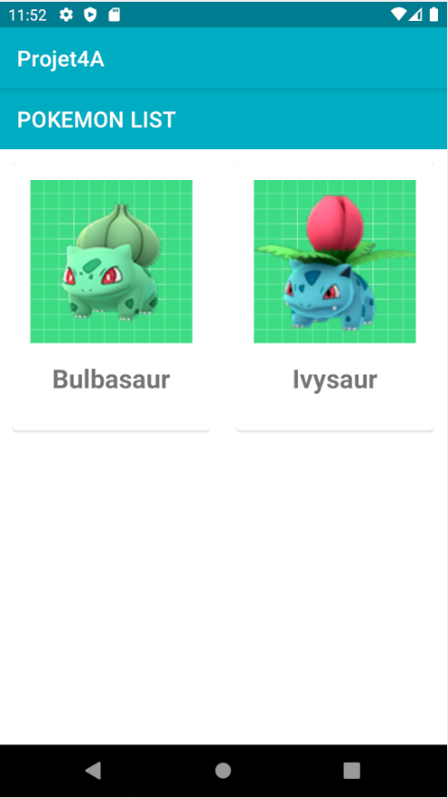
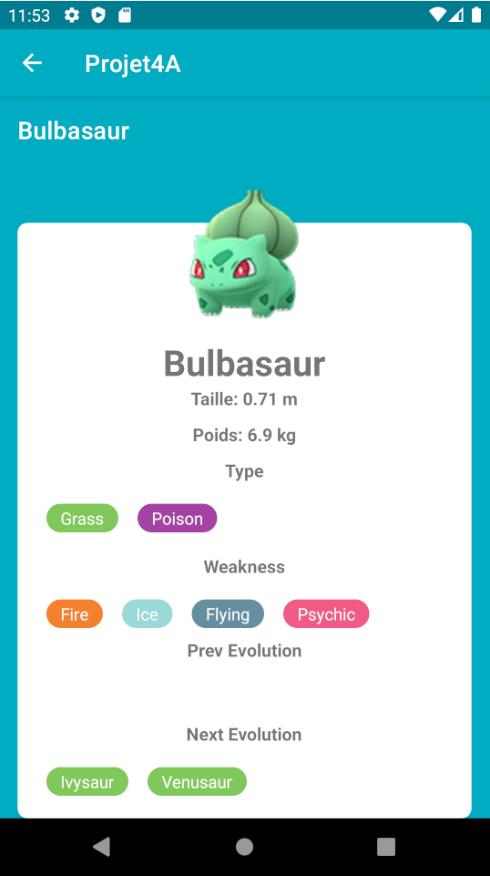

# Projet4A

Projet Kotlin/Android 4A

##Sujet

Réalisation d'une application mobile en Kotlin dans le cadre d'un projet de 4ème année.
Cette dernière affiche une liste interactive de Pokémon. Si un Pokémon est sélectionné, les informations de celui-ci sont alors affichées.
Des transitions existent aussi entre les Pokémon et leur évolutions au sein de l'affichage détaillé.

##Détails de l'application:

###Écran d'accueil

###Tentative de connexion avec login érronés

###Création de Compte
La création de compte s'effectue de la manière suivante:
Il faut d'abord entrer ses logs dans la page d'accueil (Login et Mot de Passe)
Puis appuyer sur le bouton New Account (un message d'avertissement s'affichera alors)

###Affichage de la liste Pokemon

###Affichage des détails d'un Pokémon

###Transition d'un Pokémon à son évolution (fonctionne aussi avec les formes précédentes)

##Éléments constitutifs du projet

-Kotlin
-Architecture MVVM
-Clean Architecture
-Utilisation d'une BDD
-Git
-Liste d'éléments
-RecyclerView(s)
-API Rest et affichage de son contenu via la liste
-Design via l'utilisation de composants de la bibliothèque Materials

